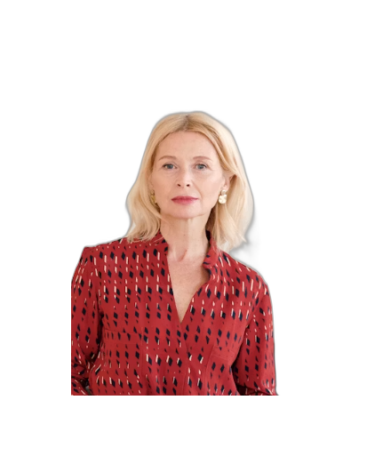

# 🪪 PassportSnap — AI-Powered Passport Photo Generator


A web-based AI application that automatically removes backgrounds from photos and generates **official passport-size images (35mm × 45mm at 300 DPI)** — ready to print in seconds.

---

## ✨ Features

- 🤖 **AI Background Removal** — powered by U2-Net via `rembg`
- 👤 **Auto Face Detection & Cropping** — uses OpenCV Haar Cascades for intelligent passport framing
- 🎨 **Multiple Background Colors** — White, Blue, or Transparent
- 📐 **Official Passport Size** — 35×45mm at 300 DPI
- ⬇️ **Instant Download** — one-click PNG download
- 🖥️ **Responsive Web UI** — works on desktop and mobile

---

## 📸 Demo

<p align="center">
  
</p>

The result page shows the final passport-size photo (35×45mm @ 300 DPI) ready for instant download, with background color applied automatically.

## 🛠️ Tech Stack

| Technology | Purpose |
|---|---|
| Python 3.13 | Core language |
| Flask | Web framework |
| rembg (U2-Net) | AI background removal |
| OpenCV | Face detection |
| Pillow | Image processing & resizing |
| HTML/CSS/JS | Frontend interface |

---

## 🚀 Getting Started

### Prerequisites
- Python 3.8 or higher
- pip

### Installation

1. **Clone the repository**
   ```bash
   git clone https://github.com/nish-coder04/passport-photo-generator.git
   cd passport-photo-generator
   ```

2. **Install dependencies**
   ```bash
   pip install -r requirements.txt
   ```

3. **Run the app**
   ```bash
   python app.py
   ```

4. **Open in browser**
   ```
   http://127.0.0.1:5000
   ```

---

## 📁 Project Structure

```
passport-photo-generator/
├── app.py              # Flask application & routes
├── utils.py            # AI processing pipeline
├── requirements.txt    # Python dependencies
└── templates/
    ├── index.html      # Upload interface
    └── result.html     # Result & download page
```

---

## ⚙️ How It Works

1. User uploads a portrait photo
2. `rembg` removes the background using the U2-Net deep learning model
3. OpenCV detects the face and crops with proper passport framing
4. Pillow resizes to 35×45mm at 300 DPI
5. Selected background color is applied
6. Final image is presented for download

---

## 📋 Requirements

```
flask
rembg[cpu]
opencv-python
Pillow
```

---

## 👩‍💻 Author

**Nishtha Shukla** — AI/ML Engineer  
🌐 [Portfolio](https://nishtha-ns.vercel.app) | 💼 [LinkedIn](https://linkedin.com/in/nishtha-shukla)

---

## 📄 License

This project is open source and available under the [MIT License](LICENSE).
